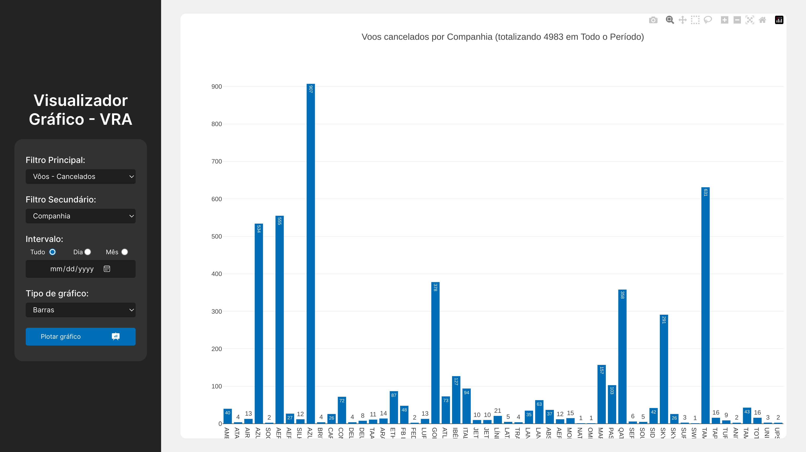

# VRA - Visualizador Gráfico

links rápidos: [Deploy atualizado - Vercel](https://1manuelc-nupreds-selecao.vercel.app/), [Relatório técnico do projeto](https://drive.google.com/file/d/1k7C3YbIgguRUlBAo8VAI0-TbU-hlhMdC/view?usp=sharing).

Esta aplicação web objetiva consumir, filtrar e plotar em gráficos as informações extraídas um dataset (de janeiro de 2024) da base de dados pública VRA (Voo Regular Ativo) em formato .csv.<br>
Utiliza dependências externas `PapaParse`, `Plotly` e o bundler `Vite`, com a linguagem de programação `JavaScript`.

<div align="center">
  </img>
  </img>
</div>


## Instalação

Para testar o projeto em sua máquina, você deve ter instalado o runtime `Node.js` e seu gerenciador de pacotes `npm`, bem como um editor de texto com acesso ao terminal, como o `Visual Studio Code`.

- Primeiro, baixe o ZIP do repositório ou
- Clone-o em sua máquina com `git clone https://github.com/1manuelc/nupreds-selecao.git`
- Na pasta raíz do seu repositório com nome `nupreds-selecao`, digite
```
  npm i
```
```
  npm run dev
```

Dependendo do seu sistema operacional, você provavelmente verá um erro sinalizando uma dependência faltante (testado somente no Windows), caso aconteça, instale a dependência sinalizada no log de erro ou:
```
  npm i @rollup/rollup-win32-x64-msvc
```
Execute normalmente com `npm run dev`
